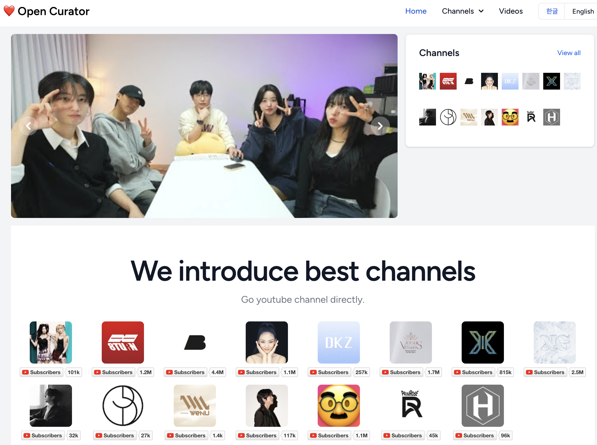
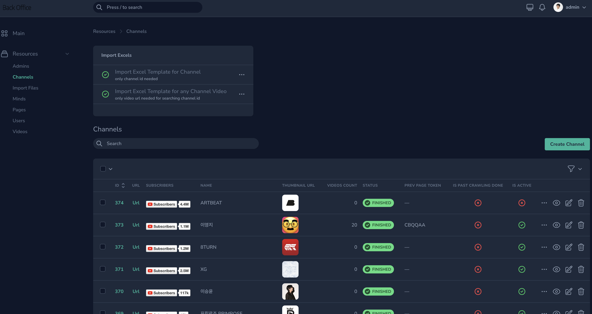

# Open Curation - YT

[](https://github.com/cable8mm/yt/actions/workflows/laravel-tests.yml)
[](https://github.com/cable8mm/yt/actions/workflows/coding-style-php.yml)

[](https://github.com/cable8mm/yt/releases)
[](https://github.com/cable8mm/yt)


Open Curation - YT is a web application that allows users to curate YouTube videos into playlists. It is built on the Laravel framework.

You only need to perform one task to maintain the website, and that is to input the channel ID. Even if you don't know it, that's okay. The system will help you retrieve the channel ID from the video URL. Additionally, the system will update channel videos automatically.

I believe that this is fantastic. Enjoy!

## Preview




## Installation

Cloning & Setting:

```sh
git clone https://github.com/cable8mm/yt.git

cd yt

composer update

cp .env.example .env

valet secure
```

Make `yt` database in MySQL. After database setup:

```sh
composer migrate

npm install

valet open
```

visit : https://yt.test

Database:

- Database : korean-job

```sh
php artisan migrate

php artisan nova:user

# make Name, Email Address, Password and create user
```

Mail:

```sh
brew install mailpit

brew services start mailpit
```

Visit to http://localhost:8025

## Development

### Queue and Schedule

If you want to make schedulers work,

```sh
php artisan schedule:work
```

and job,

```sh
php artisan queue:work
```

It can be worked asynchronously, such as registering massive numbers of YouTube videos.

### How to add languages

```sh
php artisan lang:add af
```

Refer to [this link](https://laravel-lang.com/available-locales-list.html#lists-available-locales-am) about it.

## Test

```sh
composer test
```

Also error reporting has sent to [Sentry.io](https://cable8mm.sentry.io)

## Build

Development:

```sh
npm run dev
```

Live:

```sh
npm run build
```

## CI/CD

For testing third party integration, you should make github repository secrets as belows.

*Laravel Nova* is required,

- NOVA_PASSWORD
- NOVA_USERNAME

## License

The Project YT is open-sourced software licensed under the [MIT license](https://opensource.org/licenses/MIT).
